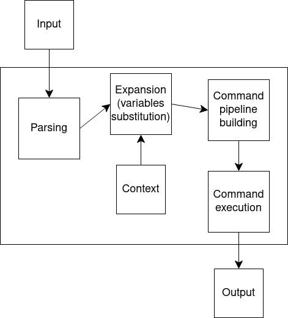

# Simple Command Line Interpreter

### Поддерживаемые команды:

* `grep [PATTERN] [FILE]...` -- находит строки по регулярному выражению

* `cat [FILE]...` -- выводит содержимое файла на экран

* `echo [ARG]...` -- выводит на экран свои аргументы

* `wc [FILE]...` -- выводит количество строк, слов и байт в файле

* `pwd` -- выводит текущую директорию

* `exit` -- выходит из интерпретатора

### Описание команд

1. Команда `grep` находит строки в файлах, подходящие под регулярное выражение.
   Принимает регулярное выражение, с которым сопоставляются строки. Принимает
   последовательность файлов, в которых ведется поиск строк. Если ни один файл не передан,
   команда ищет совпадение в потоке ввода.
   Команда поддерживает следующие ключи:
    * `-i` -- поиск не чувствителен к регистру
    * `-w` -- поиск слова только целиком
    * `-A n` -- вывод `n` строк после совпадения

2. Команда `cat` выводит содержимое последовательности файлов, переданных
   в качестве аргумента. Если последовательность файлов пуста, то читает
   содержимое из потока ввода. Если поток ввода пуст, тогда команда в интерактивном режиме
   запрашивает и выводит пользовательский ввод.
3. Команда `echo` выводит переданный список аргументов.
   Если список пуст, то выводится пустая строка.
4. Команда `wc` выводит количество строк, слов и байт в переданной последовательности файлов.
   Для каждого нового файла команда выводит информацию отдельно и указывает имя файла.
   Если последовательность файлов пуста, то читает содержимое из потока ввода.
   Если поток ввода пуст, тогда команда запрашивает пользовательский ввод
   и выводит информацию о количестве строк, слов и байт.

5. Команда `pwd` выводит текущую директорию процесса.
6. Команда `exit` завершает работу интерпретатора.

### Объявления переменных
Интерпретатор поддерживает объявление переменных. Синтаксис объявления или присваивания:
`identifier=value`. В качестве `identifier` разрешено использовать символы латинского алфавита
в обоих регистрах, цифры и знак нижнего подчеркивания. Начинаться `identifier` должен с
символа латинского алфавита в любом регистре или нижнее подчеркивание. Значение, обернутое в `""`,
может содержать любую последовательность символов, кроме неправильной подстановки. Значение,
обернутое в `''`, может содержать любую последовательность символов. Разрешено в рамках одной
команды объявлять несколько переменных, для этого их следует перечислить друг за другом,
как в примере: `var1=12 var2="hello" _Ident3='world!'`.

### Подстановка значения переменных
Для подстановки значения переменной вместо ее имени используется следующий синтаксис:
`$identifier` или `${identifier}`. Подстановка осуществляется везде, кроме выражений,
обернутых в `''`.

### Использование конвейеров
Несколько команд разрешено объединять в конвейер. При этом содержимое потока вывода
предыдущей команды передается следующей. При использовании объявлений переменных внутри конвейера,
они будут проигнорированы. Обратите внимание, что использование команды `exit` внутри
конвейера команд не приводит к завершению работы интерпретатора.

### Вызов внешних команд
Интерпретатор поддерживает вызов внешних команд, которые сам интерпретатор не поддерживает.
Пример вызова, `ls -l | grep -i "wx"`. Внешние команды можно объединять в конвейер команд как
друг с другом, так и с командами интерпретатора.

### Архитектура интерпретатора

